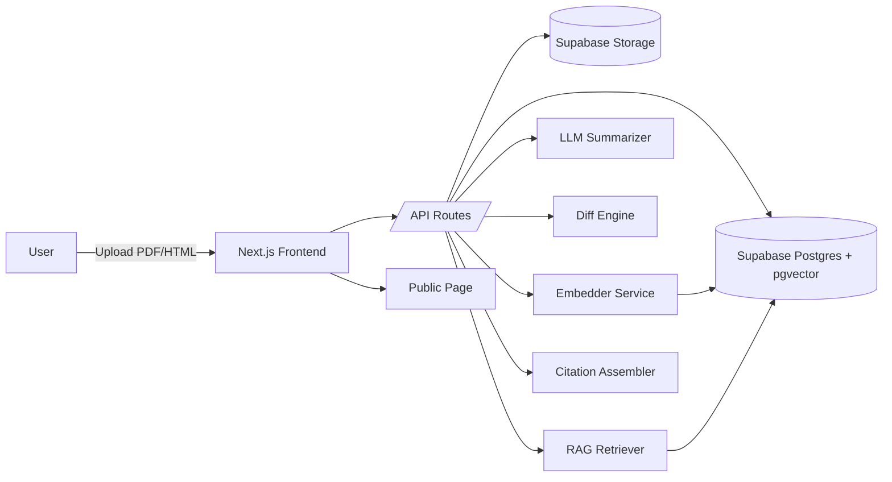

# Architecture — Open‑LegisAI Lite (MVP)
Owner: Architect • Date: 2025-09-02 • Version: 1.0

## Components
- **Frontend**: Next.js (App Router, TS, shadcn/ui). 
- **Backend**: Next.js API routes or minimal server; Supabase for auth/storage/DB; cron via Supabase Scheduler.
- **Indexing**: Extract text (pdfminer/pymupdf), segment by **clause/article**; store text + offsets; embeddings via OpenAI or local (e.g., `text-embedding-3-large` or `bge-m3`), in `pgvector`.
- **Diff**: Clause‑aware diff (hash/semantic alignment + Levenshtein for changed segments).
- **RAG**: Hybrid search (BM25 + vector); rerank top‑k; assemble answer with **strict citation blocks**.
- **Conflict flags**: Query the *existing‑law* index; rank by overlap + semantic similarity; show excerpt + link.
- **MCP/Archon**: Claude Code pinned prompt retrieves **UI acceptance**, **prompt scaffolds**, and **.env/ops guide** from Archon.

## Data Model (tables)
- `documents(id, title, source_url, kind, jurisdiction, created_at)`
- `document_versions(id, document_id, version_label, storage_path, pages, created_at)`
- `clauses(id, version_id, clause_ref, text, page_from, page_to)`
- `embeddings(id, clause_id, vector)`
- `diffs(id, v_from, v_to, clause_ref, change_kind, score)`
- `conflicts(id, version_id, law_ref, overlap_score, excerpt, cite_json)`

## Non‑Functional
- **Perf**: first summary < 3 min after upload (async jobs).
- **Reliability**: idempotent ingest; re‑run safe; DLQ for failed pages.
- **Security**: RLS on Supabase; signed URLs; redact on ingest option.
- **Observability**: structured logs; job status tables; error triage task in Archon.
